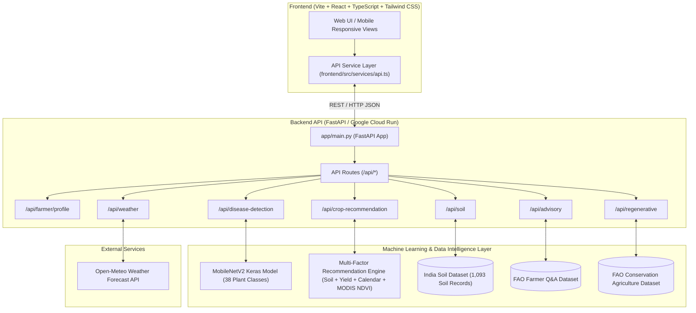

# 🌾 AgriNexus AI — Interoperable Digital Agriculture Platform

> **Hackathon Submission & Google Cloud Run Deployment Guide**

AgriNexus AI is an interoperable, AI-powered digital agriculture platform designed for smallholder farmers. It integrates live weather intelligence, soil health observations, multi-factor machine learning crop recommendations, deep learning crop disease screening (MobileNetV2), AI-driven agro-advisory, and FAO-aligned regenerative agriculture practices into a unified, multi-lingual web application.

---

## 🏗️ Architecture Overview



---

## ⚡ Quick Start (Local Setup)

### 1. Prerequisites
* Python 3.10+
* Node.js 18+

### 2. Backend Setup
```bash
# Navigate to backend directory
cd backend

# Activate virtual environment
# Windows:
.venv\Scripts\activate

# Linux/macOS:
source .venv/bin/activate

# Install dependencies
pip install -r requirements.txt

# Run FastAPI server
uvicorn app.main:app --host 0.0.0.0 --port 8000 --reload
```
* API Documentation (Swagger UI): `http://localhost:8000/docs`
* Health Check: `http://localhost:8000/api/health`

### 3. Frontend Setup
```bash
# Navigate to frontend directory
cd frontend

# Install dependencies
npm install

# Start Vite dev server
npm run dev
```
* Access Frontend UI at: `http://localhost:5173`

---

## 🧪 Automated Testing

To run the complete end-to-end integration test suite locally:
```bash
python tests/test_end_to_end.py
```
Outputs validation across all 7 core platform APIs.

---

## 📡 API Reference Documentation

| Endpoint | Method | Description | Request Payload / Params |
| :--- | :---: | :--- | :--- |
| `/api/health` | `GET` | Service health status | None |
| `/api/farmer/profile` | `GET` | Fetch active farmer profile | None |
| `/api/farmer/profile` | `PUT` | Update farmer profile details | `FarmerProfile` JSON body |
| `/api/weather` | `GET` | Live weather & 3-day forecast | `lat`, `lon` query params |
| `/api/soil` | `GET` | Soil health metrics & texture | `lat`, `lon` query params |
| `/api/crop-recommendation` | `POST` | ML crop recommendation | `{ "latitude": float, "longitude": float, "month": int }` |
| `/api/disease-detection` | `POST` | Leaf disease screening | `multipart/form-data` with `image` file |
| `/api/advisory` | `POST` | AI agro-advisory Q&A | `{ "question": "string" }` |
| `/api/regenerative` | `GET` | Regenerative practices & metrics | None |

---

## ☁️ Google Cloud Run Deployment

### Option 1: Single Container Deployment (Backend API)
Using Google Cloud CLI (`gcloud`):

```bash
# Set your GCP project ID
gcloud config set project YOUR_GCP_PROJECT_ID

# Build container using Cloud Build
gcloud builds submit --tag gcr.io/YOUR_GCP_PROJECT_ID/agrinexus-backend:latest .

# Deploy container to Cloud Run
gcloud run deploy agrinexus-backend \
  --image gcr.io/YOUR_GCP_PROJECT_ID/agrinexus-backend:latest \
  --platform managed \
  --region us-central1 \
  --allow-unauthenticated \
  --port 8080 \
  --memory 2Gi \
  --cpu 2
```

### Option 2: Full Stack Deployment (Frontend + Backend on Cloud Run)
```bash
# 1. Build and deploy backend
gcloud run deploy agrinexus-backend \
  --source . \
  --platform managed \
  --region us-central1 \
  --allow-unauthenticated \
  --memory 2Gi

# Note down the returned backend URL (e.g. https://agrinexus-backend-xyz-uc.a.run.app)

# 2. Build and deploy frontend container
cd frontend
gcloud run deploy agrinexus-frontend \
  --source . \
  --platform managed \
  --region us-central1 \
  --allow-unauthenticated \
  --set-env-vars VITE_API_BASE_URL=https://agrinexus-backend-xyz-uc.a.run.app
```

---

## 🎬 3-Minute Hackathon Demo Flow

1. **Farmer Onboarding & Location**: Show farmer profile (`Manjunath`, Mandya, Karnataka) with farm size and irrigation profile.
2. **Real-time Weather & Soil Diagnostic**: Transition to Weather (live Open-Meteo) and Soil Health cards showing pH (6.4), Nitrogen, and Texture breakdown.
3. **Multi-Factor ML Crop Recommendation**: Demonstrate crop suitability ranking based on historical yield, soil observation, calendar month, and MODIS satellite NDVI signals.
4. **Deep Learning Leaf Disease Screening**: Upload a plant leaf image; display MobileNetV2 disease detection (e.g., *Potato Early Blight*, *Apple Scab*, or *Healthy*) with confidence score and immediate field action steps.
5. **AI Agro-Advisory & Regenerative Practices**: Type a field query (e.g., *"How can I improve soil fertility?"*) to view FAO-aligned recommendations, followed by long-term regenerative practices (*No-till*, *Cover cropping*, *Crop rotation*).

---

## 🏆 Presentation Highlights

* **Interoperability**: Connects satellite observations (NDVI), global weather, soil datasets, and computer vision models seamlessly.
* **Accuracy & Honesty**: Preprocessing aligned cleanly with Keras MobileNetV2 architecture without double-scaling artefacts.
* **Practical Impact**: Empowers smallholders with localized, actionable, multi-lingual agricultural intelligence.